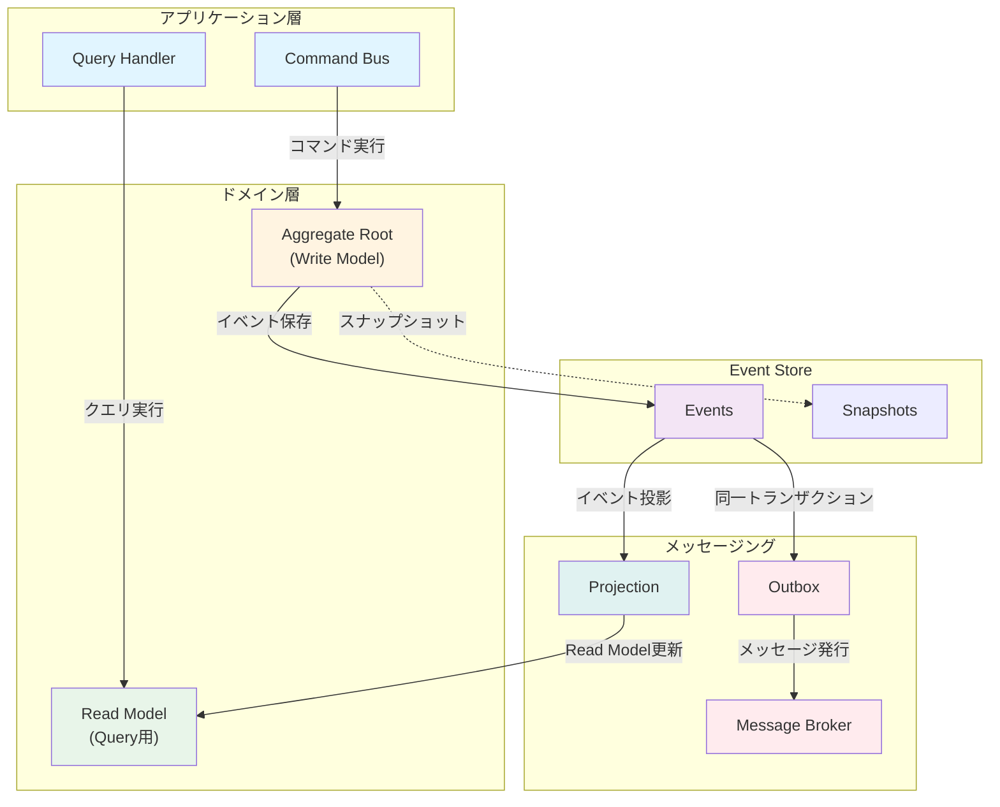

# Rails Event Sourcing + CQRS 実装パターン集

Rails で Event Sourcing + CQRS を実践するための実装例集です。gemを使わず、Pure Ruby + PostgreSQL で実装しています。

## 概要

このリポジトリでは、Event Sourcing と CQRS の主要な実装パターンを、注文ドメインを題材に段階的に学べます。

## アーキテクチャ全体像



## パターン一覧

### [01. Basic Event Store](patterns/01_basic_event_store/)
- イベントの永続化
- ストリームベースの管理
- 楽観的ロック
- **学べること**: Event Sourcingの基礎

### [02. Aggregate Root](patterns/02_aggregate_root/)
- ドメインロジックのカプセル化
- コマンドとイベントの分離
- イベントリプレイによる状態復元
- **学べること**: DDDのAggregateパターン

### [03. CQRS](patterns/03_cqrs/)
- CommandとQueryの分離
- Command Bus / Query Handler
- Write Model と Read Model
- **学べること**: 読み書きの責務分離

### [04. Transactional Outbox](patterns/04_outbox_pattern/)
- Dual Write問題の解決
- トランザクション境界内でのメッセージ記録
- Polling Publisher
- **学べること**: データ整合性の保証

### [05. Projection](patterns/05_projection/)
- Event Stream から Read Model を生成
- Checkpoint による進捗管理
- Projection の再構築
- **学べること**: イベント駆動のビュー更新

### [06. Snapshot](patterns/06_snapshot/)
- Aggregate 復元の最適化
- 定期的な状態の保存
- パフォーマンス改善
- **学べること**: 大量イベント対応

## セットアップ

### 必要な環境
- Ruby 3.0+
- PostgreSQL 13+

### データベースセットアップ

```bash
# データベース作成
createdb event_sourcing_demo
createdb event_sourcing_test

# PostgreSQL接続
psql event_sourcing_demo

# 各パターンのmigration.sqlを実行
\i patterns/01_basic_event_store/migration.sql
\i patterns/04_outbox_pattern/migration.sql
\i patterns/05_projection/migration.sql
\i patterns/06_snapshot/migration.sql

# Read Modelテーブル作成（patterns/03_cqrs/read_model.rb参照）
```

### 実行例

各パターンのディレクトリで`example.rb`を実行:

```bash
cd patterns/01_basic_event_store
ruby example.rb

cd ../02_aggregate_root
ruby example.rb

# 以下同様...
```

## 実装パターンの統合

実際のアプリケーションでは、これらのパターンを組み合わせて使用します：

### 1. 基本的な統合フロー

```ruby
# Command実行
command = CreateOrderCommand.new(
  order_id: '123',
  customer_id: 1,
  items: [...]
)

# Command Handler
conn.transaction do
  # 1. Aggregateで処理
  order = Order.new
  order.create(customer_id: command.customer_id, items: command.items)

  # 2. Event Storeに保存
  repository.save(order, "Order-#{command.order_id}")

  # 3. Outboxに記録（同じトランザクション内）
  order.uncommitted_events.each do |event|
    outbox.add(
      aggregate_id: "Order-#{command.order_id}",
      event_type: event.event_type,
      payload: event.data
    )
  end

  # 4. 同期Projectionを更新（オプション）
  projection.project_sync(order)
end

# 5. Outbox Publisherがメッセージを発行
# 6. 非同期Projectionが更新される
```

### 2. Query実行

```ruby
# Queryで読み取り
query = GetOrderQuery.new(order_id: '123')
result = query_handler.handle(query)

# Read Modelから取得（高速）
order_data = result.data
```

## 主要概念の整理

### Event Sourcing
- **現在の状態 = すべてのイベントの適用結果**
- イベントは不変で削除しない
- 完全な監査ログ
- 時間をさかのぼって状態を再現可能

### CQRS
- **Write Model**: ビジネスロジックに最適化
- **Read Model**: クエリに最適化（非正規化）
- 独立してスケール可能
- 結果整合性（Eventual Consistency）

### Transactional Outbox
- データベース更新とメッセージ発行を原子的に実行
- At-Least-Once配信
- 消費者側で冪等性が必要

### Projection
- イベントからビューを生成
- 複数の異なるビューを持てる
- 再構築可能

### Snapshot
- パフォーマンス最適化
- オプショナル（なくても動作する）
- スナップショット + 差分イベント = 現在の状態

## ベストプラクティス

### 1. イベント設計
```ruby
# 良い例：過去形、具体的
OrderCreated
OrderSubmitted
OrderShipped

# 悪い例：動詞、抽象的
CreateOrder
OrderUpdate
```

### 2. Aggregateの境界
- 小さく保つ
- トランザクション境界 = Aggregate境界
- 1つのAggregateに多数のイベントは避ける

### 3. Read Modelの設計
- クエリに最適化
- 非正規化を恐れない
- 複数のRead Modelを用途別に作成

### 4. 冪等性
- At-Least-Once配信を前提
- イベントID でキーワード処理済みを記録
- 副作用のある操作は慎重に

## トレードオフ

### メリット
- 完全な監査ログ
- 柔軟なクエリ（複数のRead Model）
- スケーラビリティ
- 時間軸でのデバッグ

### デメリット
- 学習コスト
- 結果整合性
- 運用の複雑さ
- イベントスキーマの進化が必要

## 参考資料

### 書籍
- "Implementing Domain-Driven Design" by Vaughn Vernon
- "Event Sourcing and CQRS" by Greg Young

### オンラインリソース
- [microservices.io - Event Sourcing](https://microservices.io/patterns/data/event-sourcing.html)
- [Microsoft - CQRS Pattern](https://learn.microsoft.com/en-us/azure/architecture/patterns/cqrs)
- [Rails Event Store](https://railseventstore.org/)

## ライセンス

MIT License

## 貢献

Issue や Pull Request を歓迎します。

## 注意事項

このリポジトリは学習・デモ目的です。本番環境で使用する場合は、以下を検討してください：

- エラーハンドリングの強化
- ログ記録の充実
- モニタリング
- セキュリティ
- パフォーマンステスト
- イベントスキーマのバージョニング
