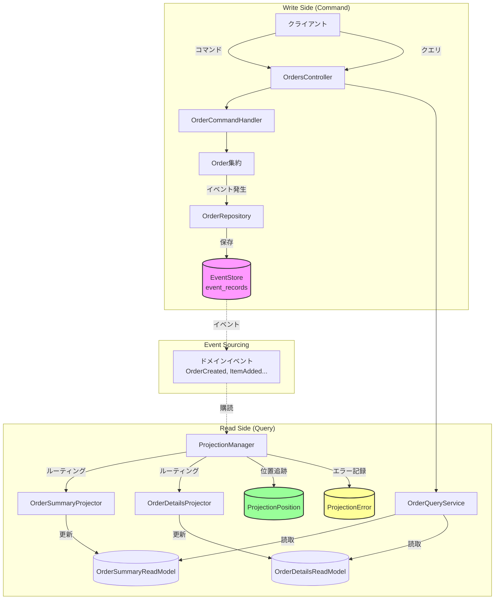
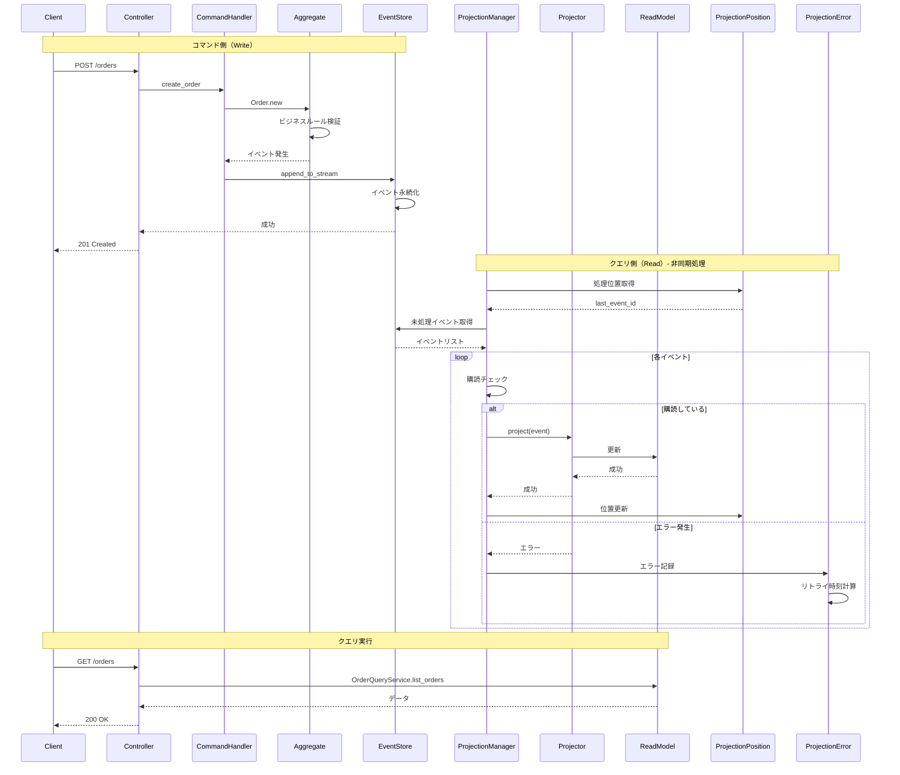
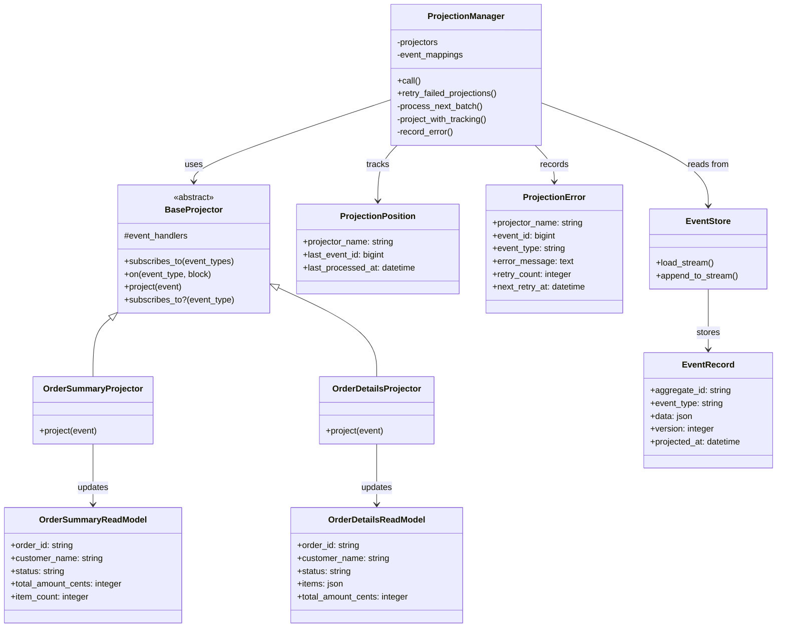
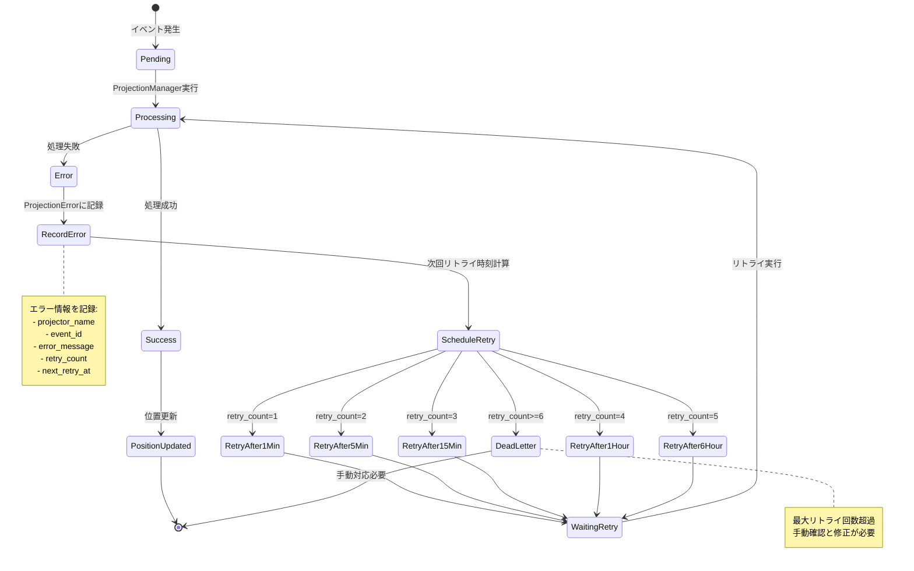

# 注文ドメインで学ぶ Event Sourcing + CQRS 実装例（改善版）

Rails 標準機能のみを用いて、**業界標準パターンを参考にした** Event Sourcing と CQRS の実装例です。example_1 の基本実装に対し、以下の改善を施しています。

## アーキテクチャ概要



## Example 1 からの改善点

### 1. 宣言的な Projector 実装

**Before (example_1):**
```ruby
def project(event)
  case event
  when Orders::Events::OrderCreated
    handle_order_created(event)
  when Orders::Events::ItemAdded
    handle_item_added(event)
  end
end
```

**After (example_2):**
```ruby
class OrderSummaryProjector < BaseProjector
  # 購読するイベントを宣言
  subscribes_to [
    Orders::Events::OrderCreated,
    Orders::Events::ItemAdded,
    # ...
  ]

  # イベントハンドラを宣言的に登録
  on Orders::Events::OrderCreated do |event|
    OrderSummaryReadModel.create!(...)
  end

  on Orders::Events::ItemAdded do |event|
    # ...
  end
end
```

**メリット:**
- Rails Event Store などのライブラリと同様の宣言的な API
- イベントハンドラの登録がシンプルで見通しが良い
- 購読するイベントが明確

### 2. 冪等性の保証（Projection Position Tracking）

**新規テーブル: `projection_positions`**
```ruby
# projector_name: string (例: "order_summary_projector")
# last_event_id: bigint
# last_processed_at: datetime
```

**動作:**
- 各 Projector ごとに処理済みイベント ID を記録
- 同じイベントを 2 回処理することを防ぐ
- 各 Projector が独立して進捗を管理

**メリット:**
- 重複処理を確実に防止
- 特定の Projector だけを再実行可能
- 各 Projector の処理状況を監視可能

### 3. エラーハンドリングと自動リトライ

**新規テーブル: `projection_errors`**
```ruby
# projector_name: string
# event_id: bigint
# event_type: string
# error_message: text
# retry_count: integer
# next_retry_at: datetime
```

**動作:**
- Projector でエラーが発生すると `projection_errors` に記録
- バックオフ付き自動リトライ（1分 → 5分 → 15分 → 1時間 → 6時間）
- 最大 5 回までリトライ

**メリット:**
- 一時的なエラー（DB接続失敗など）から自動復旧
- Dead Letter Queue パターンの実装
- エラーの監視と分析が容易

### 4. 効率的なイベントルーティング

**Before (example_1):**
```ruby
# すべてのイベントをすべての Projector に送信
@projectors.each { |projector| projector.project(event) }
```

**After (example_2):**
```ruby
# 購読しているイベントのみを送信
projectors.each do |projector|
  next unless projector.subscribes_to?(event.class)
  projector.project(event)
end
```

**メリット:**
- 不要な処理を削減
- 複数の Projector がある場合のパフォーマンス向上

## イベントフローと処理シーケンス



## クラス依存関係図



## ディレクトリ構成

```
example_2/
├── app/
│   ├── controllers/          # REST API（example_1 と同じ）
│   ├── domain/orders/        # 集約・リポジトリ・イベント（example_1 と同じ）
│   ├── event_sourcing/       # Event Store（example_1 と同じ）
│   ├── models/
│   │   └── application_record.rb
│   └── projections/
│       ├── base_projector.rb          # ★NEW: Projector 基底クラス
│       ├── projection_manager.rb      # ★NEW: 改善版 Runner
│       ├── models/
│       │   ├── projection_position.rb # ★NEW: 位置追跡
│       │   ├── projection_error.rb    # ★NEW: エラー記録
│       │   ├── order_summary_read_model.rb
│       │   └── order_details_read_model.rb
│       ├── projectors/
│       │   ├── order_summary_projector.rb  # 改善版
│       │   └── order_details_projector.rb  # 改善版
│       └── queries/
│           └── order_query_service.rb
├── config/routes.rb
└── db/migrate/
    ├── 20241017000001_create_event_records.rb
    ├── 20241017000002_create_order_summary_read_models.rb
    ├── 20241017000003_create_order_details_read_models.rb
    ├── 20241018000001_create_projection_positions.rb  # ★NEW
    └── 20241018000002_create_projection_errors.rb     # ★NEW
```

## 動作手順

### 1. セットアップ

Rails プロジェクトに `example_2/app`, `config`, `db` をコピーします。

```bash
# マイグレーション実行
bin/rails db:migrate
```

### 2. Projection 処理の実行

Rake タスクまたはスクリプトで Projection を実行します。

```ruby
# lib/tasks/event_sourcing.rake
namespace :event_sourcing do
  desc "Run projections for all events"
  task project: :environment do
    projectors = [
      Projections::Projectors::OrderSummaryProjector.new,
      Projections::Projectors::OrderDetailsProjector.new
    ]

    manager = Projections::ProjectionManager.new(
      event_mappings: Orders::EventMappings.build,
      projectors: projectors
    )

    manager.call
    puts "Projection completed"
  end

  desc "Retry failed projections"
  task retry_failed: :environment do
    projectors = [
      Projections::Projectors::OrderSummaryProjector.new,
      Projections::Projectors::OrderDetailsProjector.new
    ]

    manager = Projections::ProjectionManager.new(
      event_mappings: Orders::EventMappings.build,
      projectors: projectors
    )

    manager.retry_failed_projections
    puts "Retry completed"
  end
end
```

### 3. 定期実行（Cron）

```bash
# 5分ごとに通常の投影を実行
*/5 * * * * cd /path/to/app && bin/rails event_sourcing:project

# 10分ごとに失敗した投影をリトライ
*/10 * * * * cd /path/to/app && bin/rails event_sourcing:retry_failed
```

## API エンドポイント例

example_1 と同じエンドポイントを提供します。

```bash
# 注文作成
curl -X POST http://localhost:3000/orders \
  -H "Content-Type: application/json" \
  -d '{"order":{"customer_name":"山田太郎"}}'

# 商品追加
curl -X POST http://localhost:3000/orders/{order_id}/add_item \
  -H "Content-Type: application/json" \
  -d '{"order_item":{"product_name":"ノートPC","quantity":1,"unit_price_cents":120000}}'

# 注文確定
curl -X POST http://localhost:3000/orders/{order_id}/confirm

# 注文一覧
curl http://localhost:3000/orders

# 注文詳細
curl http://localhost:3000/orders/{order_id}
```

## エラーハンドリングとリトライメカニズム



## 監視とデバッグ

### Projection の進捗確認

```ruby
# Rails console
Projections::Models::ProjectionPosition.all
# => [
#   <ProjectionPosition projector_name: "order_summary_projector", last_event_id: 42>,
#   <ProjectionPosition projector_name: "order_details_projector", last_event_id: 42>
# ]
```

### エラーの確認

```ruby
# 失敗したイベント一覧
Projections::Models::ProjectionError.failed

# 特定の Projector のエラー
Projections::Models::ProjectionError.for_projector("order_summary_projector")

# リトライ待ちのエラー
Projections::Models::ProjectionError.pending_retry
```

## 業界標準との対比

| パターン | 実装方法 | 参考ライブラリ |
|---------|---------|-------------|
| 宣言的イベントハンドラ | `subscribes_to`, `on` メソッド | Rails Event Store, Eventide |
| Projection Position | `projection_positions` テーブル | Rails Event Store, Axon Framework |
| Dead Letter Queue | `projection_errors` テーブル | AWS SQS DLQ, RabbitMQ DLQ |
| Backoff Retry | 段階的遅延リトライ | Sidekiq, AWS Step Functions |
| イベントルーティング | 購読情報ベースの配信 | イベントバス (EventBridge, Kafka) |

## Example 1 との使い分け

**Example 1 を選ぶケース:**
- シンプルさ優先
- Projector が 1-2 個程度
- 学習目的

**Example 2 を選ぶケース:**
- プロダクション環境
- 複数の Projector を運用
- エラーハンドリングが重要
- 冪等性の保証が必要

## まとめ

Example 2 は、外部ライブラリを使わずに以下の業界標準パターンを実装しています。

- ✅ 宣言的な Projector 定義
- ✅ Projection 位置追跡による冪等性保証
- ✅ Dead Letter Queue パターン
- ✅ バックオフ付き自動リトライ
- ✅ 効率的なイベントルーティング

これにより、Rails Event Store などのライブラリの背後にある仕組みを理解しつつ、プロダクションレベルの堅牢性を実現できます。
