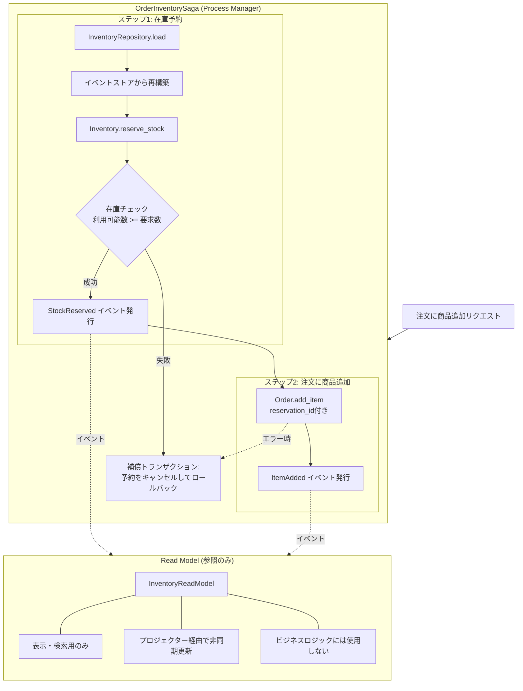

# Example 3: Event Sourcing + CQRS + 在庫管理

このexampleは、Event SourcingとCQRSパターンに**在庫管理機能**を追加した実装例です。

## 主な特徴

### example_2 からの追加機能

1. **Inventory ドメイン（在庫管理）**
   - 商品ごとの在庫管理
   - 在庫の追加・予約・確定・キャンセル・期限切れ処理

2. **在庫予約の2段階プロセス**
   - 注文時に在庫を予約（仮確保）
   - 注文確定時に予約を確定（在庫から減算）
   - 注文キャンセル時に予約を解放

3. **Process Manager（Saga）**
   - Order と Inventory の複数集約を調整
   - 補償トランザクション（失敗時のロールバック）

4. **予約タイムアウト機能**
   - 予約の有効期限（デフォルト15分）
   - 自動的に期限切れ予約を解放

## 重要な設計上の特徴

### クエリ側の反映遅延に影響されない在庫整合性

**質問**: 注文時に商品を操作する際、在庫を増減させる必要がある場合、クエリ側の反映が遅いと実在庫と乖離が生まれる可能性があるのでは？

**回答**: **影響されません**。なぜなら：

1. **コマンド側では常にイベントストアから状態を再構築**
   - 在庫の確認・予約時は、InventoryRepositoryがイベントストアからInventory集約を再構築
   - Read Modelには一切依存しない
   - 最新のイベントに基づいた正確な在庫数を保証

2. **2段階の予約プロセス**
   ```
   注文に商品追加
   ├─ ステップ1: Inventory集約で在庫を予約（イベントストアベース）
   └─ ステップ2: 予約成功後、Order集約に商品を追加
   ```

3. **Read Modelは参照のみ**
   - Read Model（InventoryReadModel）は表示・検索用
   - ビジネスロジックの判断には使用しない

### アーキテクチャ図



## ディレクトリ構造

```
example_3/
├── app/
│   ├── domain/
│   │   ├── orders/              # 注文ドメイン（example_2と同じ + 予約ID対応）
│   │   └── inventory/           # 在庫ドメイン（新規）
│   │       ├── inventory.rb     # Inventory集約
│   │       ├── inventory_item.rb # 予約情報の値オブジェクト
│   │       ├── events/          # 在庫イベント
│   │       │   ├── stock_added.rb
│   │       │   ├── stock_reserved.rb
│   │       │   ├── reservation_confirmed.rb
│   │       │   ├── reservation_cancelled.rb
│   │       │   └── reservation_expired.rb
│   │       ├── inventory_command_handler.rb
│   │       ├── inventory_repository.rb
│   │       ├── event_mappings.rb
│   │       └── container.rb
│   ├── process_managers/        # Process Manager（Saga）
│   │   └── order_inventory_saga.rb
│   ├── projections/
│   │   ├── models/
│   │   │   └── inventory_read_model.rb  # 在庫Read Model
│   │   ├── projectors/
│   │   │   └── inventory_projector.rb   # 在庫プロジェクター
│   │   └── queries/
│   │       └── inventory_query_service.rb
│   └── controllers/
│       ├── orders_controller.rb        # Saga統合
│       └── inventory_controller.rb     # 在庫管理API
├── lib/tasks/
│   └── inventory.rake           # 在庫管理タスク
└── docs/
    └── inventory_management.md  # 詳細設計ドキュメント
```

## セットアップ

### 1. データベースマイグレーション

```bash
cd example_3
rails db:migrate
```

### 2. 在庫データの初期化（任意）

```bash
# 商品の在庫を追加
rails inventory:add_stock[product_001,100]
rails inventory:add_stock[product_002,50]
```

## 使用例

### 1. 在庫を追加

```bash
curl -X POST http://localhost:3000/inventory/product_001/add_stock \
  -H "Content-Type: application/json" \
  -d '{"quantity": 100}'
```

### 2. 在庫を確認

```bash
curl http://localhost:3000/inventory/product_001
```

レスポンス例:
```json
{
  "product_id": "product_001",
  "total_quantity": 100,
  "reserved_quantity": 0,
  "available_quantity": 100,
  "reservations": []
}
```

### 3. 注文を作成

```bash
curl -X POST http://localhost:3000/orders \
  -H "Content-Type: application/json" \
  -d '{
    "order": {
      "customer_name": "山田太郎"
    }
  }'
```

レスポンス:
```json
{
  "order_id": "uuid-here"
}
```

### 4. 商品を注文に追加（在庫予約を含む）

```bash
curl -X POST http://localhost:3000/orders/{order_id}/add_item \
  -H "Content-Type: application/json" \
  -d '{
    "order_item": {
      "product_id": "product_001",
      "product_name": "ノートPC",
      "quantity": 2,
      "unit_price_cents": 80000
    }
  }'
```

**内部処理の流れ**:
1. Inventory集約で在庫を確認（イベントストアから再構築）
2. 在庫が十分なら予約（StockReserved イベント）
3. 予約成功後、Order集約に商品追加（ItemAdded イベント）

在庫不足の場合:
```json
{
  "error": "insufficient stock: available=1, requested=2"
}
```

### 5. 在庫を再確認（予約が反映されている）

```bash
curl http://localhost:3000/inventory/product_001
```

レスポンス:
```json
{
  "product_id": "product_001",
  "total_quantity": 100,
  "reserved_quantity": 2,
  "available_quantity": 98,
  "reservations": [
    {
      "reservation_id": "reservation-uuid",
      "quantity": 2,
      "expires_at": "2024-10-18T12:30:00Z"
    }
  ]
}
```

### 6. 注文を確定（予約を確定）

```bash
curl -X POST http://localhost:3000/orders/{order_id}/confirm
```

**内部処理の流れ**:
1. Order集約を確定（OrderConfirmed イベント）
2. Inventory集約で予約を確定（ReservationConfirmed イベント）
   - 在庫から数量を減算
   - 予約を削除

### 7. 在庫を再確認（予約が確定され、総在庫が減少）

```bash
curl http://localhost:3000/inventory/product_001
```

レスポンス:
```json
{
  "product_id": "product_001",
  "total_quantity": 98,
  "reserved_quantity": 0,
  "available_quantity": 98,
  "reservations": []
}
```

### 8. 注文をキャンセル（予約を解放）

```bash
curl -X POST http://localhost:3000/orders/{order_id}/cancel \
  -H "Content-Type: application/json" \
  -d '{
    "order": {
      "reason": "顧客都合"
    }
  }'
```

**内部処理の流れ**:
1. Order集約をキャンセル（OrderCancelled イベント）
2. Inventory集約で予約をキャンセル（ReservationCancelled イベント）
   - 予約を削除
   - 予約数量を利用可能に戻す

## 予約タイムアウト処理

### 期限切れ予約の自動解放

```bash
# 期限切れの予約を検出・解放
rails inventory:expire_reservations
```

このタスクを定期的に実行（cron, Sidekiq-cronなど）することで、
未確定の予約を自動的に解放できます。

### その他のRakeタスク

```bash
# 在庫を追加
rails inventory:add_stock[product_id,quantity]

# 在庫を表示
rails inventory:show[product_id]

# すべての在庫を一覧表示
rails inventory:list
```

## 主要コンポーネント

### Inventory 集約

**責務**:
- 商品ごとの在庫管理
- 在庫の追加・予約・確定・キャンセル・期限切れ処理
- ビジネスルールの検証（在庫不足チェック）

**主要メソッド**:
- `add_stock(quantity)` - 在庫追加
- `reserve_stock(quantity, reservation_id, expires_in)` - 在庫予約
- `confirm_reservation(reservation_id)` - 予約確定
- `cancel_reservation(reservation_id)` - 予約キャンセル
- `expire_reservation(reservation_id)` - 予約期限切れ処理

### OrderInventorySaga (Process Manager)

**責務**:
- Order と Inventory の複数集約を調整
- トランザクションの整合性を保証
- エラー時の補償トランザクション

**主要メソッド**:
- `add_item_with_reservation` - 在庫予約 → 注文に商品追加
- `confirm_order_with_inventory` - 注文確定 → 予約確定
- `cancel_order_with_inventory` - 注文キャンセル → 予約解放

## Event Sourcing の利点を活用

1. **完全な監査ログ**
   - すべての在庫変動がイベントとして記録される
   - 予約・確定・キャンセルの履歴が追跡可能

2. **時間旅行**
   - 過去の任意の時点の在庫状態を復元可能

3. **柔軟なRead Model**
   - 同じイベントから複数のビューを構築
   - 在庫分析、予約状況レポートなど

4. **デバッグが容易**
   - イベントを再生して問題を再現

## 詳細ドキュメント

- [在庫管理の詳細設計](docs/inventory_management.md)

## まとめ

このexampleでは：

✅ **在庫予約の2段階プロセス**により、整合性を保証
✅ **イベントストアからの再構築**により、Read Modelの遅延に影響されない
✅ **Process Manager（Saga）**で複数集約を安全に調整
✅ **予約タイムアウト**で在庫の占有を防ぐ
✅ **Event Sourcing**で完全な監査ログと柔軟性を実現

Event SourcingとCQRSパターンを使った実践的な在庫管理システムの実装方法を学べます。
