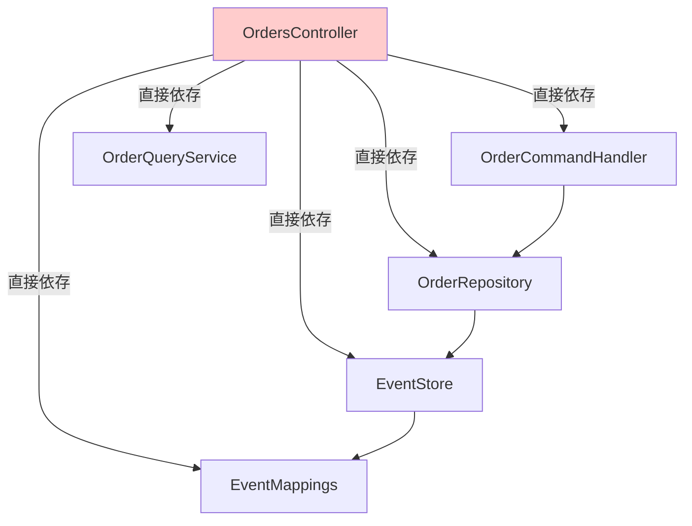
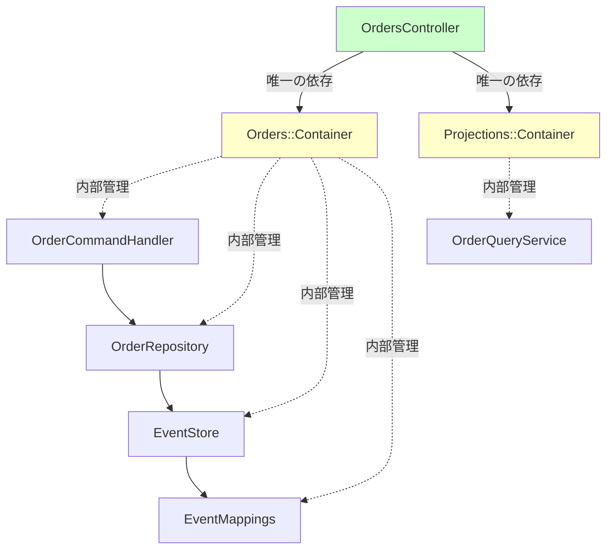
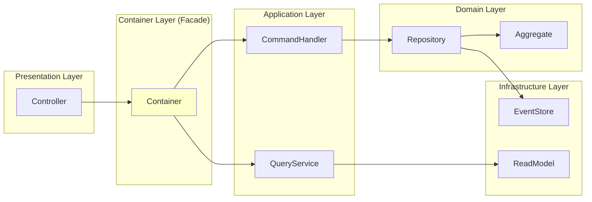
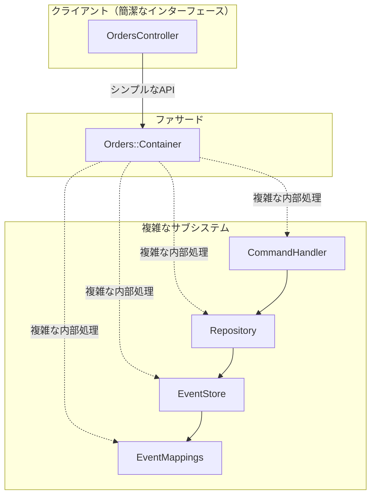

# Container による依存関係の整理

## Container がない場合（Before）



**問題点:**
- Controllerが5つのクラスに直接依存
- 依存関係が複雑で追跡困難
- テスト時に5つすべてをモック化する必要がある
- 変更時の影響範囲が不明確

## Container がある場合（After）



**メリット:**
- **Controllerの依存は2つのContainerのみ**
- 内部の複雑な依存関係はContainerが管理
- テスト時はContainerをモック化するだけ
- 変更の影響がContainerに閉じ込められる

## 具体的なコード例

### Before: Controllerが複数のクラスに直接依存

```ruby
class OrdersController < ApplicationController
  def create
    # 依存関係を直接構築（複雑）
    event_mappings = Orders::EventMappings.build
    event_store = EventSourcing::EventStore.new(event_mappings: event_mappings)
    repository = Orders::OrderRepository.new(event_store: event_store)
    command_handler = Orders::OrderCommandHandler.new(repository: repository)

    order_id = command_handler.create_order(...)
    render json: { order_id: order_id }
  end

  def index
    # 別の依存関係
    query_service = Projections::Queries::OrderQueryService.new
    summaries = query_service.list_orders
    render json: summaries
  end
end
```

**依存関係:**
```
OrdersController 依存
├── Orders::EventMappings
├── EventSourcing::EventStore
├── Orders::OrderRepository
├── Orders::OrderCommandHandler
└── Projections::Queries::OrderQueryService
```

### After: Containerのみに依存

```ruby
class OrdersController < ApplicationController
  def create
    # Container経由で取得（シンプル）
    order_id = command_handler.create_order(...)
    render json: { order_id: order_id }
  end

  def index
    # Container経由で取得（シンプル）
    summaries = query_service.list_orders
    render json: summaries
  end

  private

  # Controllerの依存は2つのContainerのみ
  def command_handler
    Orders::Container.command_handler
  end

  def query_service
    Projections::Container.query_service
  end
end
```

**依存関係:**
```
OrdersController 依存
├── Orders::Container
└── Projections::Container
```

## Containerの内部構造

```ruby
module Orders
  class Container
    class << self
      # 外部に公開するAPI（パブリックインターフェース）
      def command_handler
        @command_handler ||= OrderCommandHandler.new(repository: repository)
      end

      # 内部で使用（プライベートな依存）
      def repository
        @repository ||= OrderRepository.new(event_store: event_store)
      end

      # 内部で使用（プライベートな依存）
      def event_store
        @event_store ||= EventSourcing::EventStore.new(
          event_mappings: EventMappings.build
        )
      end

      # テスト用
      def reset!
        @command_handler = nil
        @repository = nil
        @event_store = nil
      end
    end
  end
end
```

## 依存関係の階層化



**階層:**
1. **Presentation Layer**: Controller
2. **Facade Layer**: Container（依存関係の窓口）
3. **Application Layer**: CommandHandler, QueryService
4. **Domain Layer**: Repository, Aggregate
5. **Infrastructure Layer**: EventStore, ReadModel

## ファサードパターン（Facade Pattern）

Containerは**ファサードパターン**を実装しています。



**ファサードの役割:**
- 複雑なサブシステムをシンプルなインターフェースで隠蔽
- クライアントは詳細を知る必要がない
- 変更の影響を局所化

## テスト時の依存関係

### Before: 5つのモックが必要

```ruby
RSpec.describe OrdersController do
  let(:mock_mappings) { double }
  let(:mock_event_store) { instance_double(EventSourcing::EventStore) }
  let(:mock_repository) { instance_double(Orders::OrderRepository) }
  let(:mock_handler) { instance_double(Orders::OrderCommandHandler) }
  let(:mock_query) { instance_double(Projections::Queries::OrderQueryService) }

  before do
    # 5つの依存をスタブ（複雑）
    allow(Orders::EventMappings).to receive(:build).and_return(mock_mappings)
    allow(EventSourcing::EventStore).to receive(:new).and_return(mock_event_store)
    allow(Orders::OrderRepository).to receive(:new).and_return(mock_repository)
    allow(Orders::OrderCommandHandler).to receive(:new).and_return(mock_handler)
    allow(Projections::Queries::OrderQueryService).to receive(:new).and_return(mock_query)
  end
end
```

### After: 2つのモックで済む

```ruby
RSpec.describe OrdersController do
  let(:mock_handler) { instance_double(Orders::OrderCommandHandler) }
  let(:mock_query) { instance_double(Projections::Queries::OrderQueryService) }

  before do
    # 2つのContainerをスタブ（シンプル）
    allow(Orders::Container).to receive(:command_handler).and_return(mock_handler)
    allow(Projections::Container).to receive(:query_service).and_return(mock_query)
  end
end
```

## 依存性逆転の原則（Dependency Inversion Principle）

```mermaid
graph TB
    subgraph "Before: 具象に依存"
        ControllerBefore[Controller]
        ConcreteHandler[OrderCommandHandler]
        ConcreteRepo[OrderRepository]
        ConcreteStore[EventStore]

        ControllerBefore -->|直接依存| ConcreteHandler
        ControllerBefore -->|直接依存| ConcreteRepo
        ControllerBefore -->|直接依存| ConcreteStore
    end

    subgraph "After: 抽象に依存"
        ControllerAfter[Controller]
        AbstractContainer[Container<br/>抽象インターフェース]
        ConcreteContainer[Orders::Container<br/>具象実装]

        ControllerAfter -->|抽象に依存| AbstractContainer
        AbstractContainer <-.実装.- ConcreteContainer

        ConcreteContainer -.->|内部管理| ConcreteHandler
    end
```

**DIP準拠:**
- Controller は抽象（Container）に依存
- 具象（CommandHandler等）の詳細を知らない
- テスト時は別の実装に差し替え可能

## まとめ

### Container導入による効果

| 項目 | Before | After |
|------|--------|-------|
| **Controllerの直接依存** | 5つのクラス | 2つのContainer |
| **依存関係の見通し** | ❌ 複雑 | ✅ シンプル |
| **テストのモック数** | 5つ | 2つ |
| **変更の影響範囲** | 広い | 狭い（Containerに閉じる） |
| **デザインパターン** | なし | Facade, DI Container |
| **SOLID原則** | DIP違反 | DIP準拠 |

### 結論

**「ControllerがContainerだけに依存すればよくなる」というあなたの理解は完全に正しいです！**

Container は：
1. ✅ **依存関係の窓口**として機能
2. ✅ 複雑な内部依存を**カプセル化**
3. ✅ Controller を**シンプル**に保つ
4. ✅ **テストを容易**にする
5. ✅ **変更に強い**設計を実現

これにより、**関心の分離**と**保守性の向上**が達成されます。
