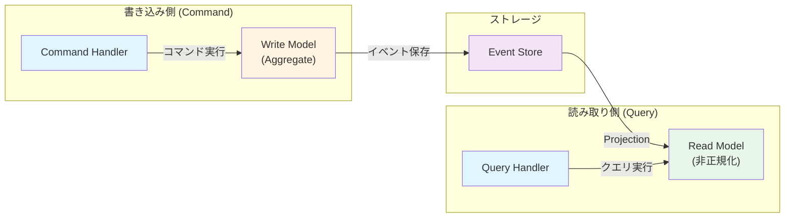

# 03. CQRS (Command Query Responsibility Segregation)

## 概要

CQRSは、読み取り（Query）と書き込み（Command）の責任を分離するアーキテクチャパターンです。Event Sourcingと組み合わせることで、高度なスケーラビリティと柔軟性を実現できます。

## 主要概念

### Command（コマンド）
- **意図**を表現する（例: CreateOrder, SubmitOrder）
- **Write Model** を変更
- **副作用**を持つ
- 成功/失敗を返す

### Query（クエリ）
- **データの読み取り**のみ
- **Read Model** にアクセス
- **副作用なし**
- データを返す

### Write Model vs Read Model



## メリット

### 1. 独立したスケーリング
- 読み取りと書き込みを別々にスケール
- 読み取りが多い場合、Read Modelだけを増強

### 2. 最適化されたモデル
- Write Model: ビジネスロジックに最適化
- Read Model: クエリに最適化（非正規化）

### 3. 柔軟なクエリ
- 複数の異なるRead Modelを持てる
- 用途に応じた最適なデータ構造

## ファイル構成

- `command.rb`: Commandオブジェクトの基底クラス
- `command_bus.rb`: コマンドをハンドラにディスパッチ
- `command_handler.rb`: コマンドを処理
- `query.rb`: Queryオブジェクトの基底クラス
- `query_handler.rb`: クエリを処理
- `read_model.rb`: 読み取り専用モデル
- `example.rb`: 使用例
- `cqrs_spec.rb`: テストコード

## 実装例

### Command側

```ruby
# コマンド定義
class CreateOrder < Command
  attr_reader :customer_id, :items

  def initialize(customer_id:, items:)
    @customer_id = customer_id
    @items = items
  end
end

# コマンドハンドラ
class CreateOrderHandler
  def handle(command)
    order = Order.new
    order.create(
      customer_id: command.customer_id,
      items: command.items
    )
    repository.save(order, "Order-#{order.id}")
  end
end

# 使用
command_bus.dispatch(CreateOrder.new(customer_id: 1, items: [...]))
```

### Query側

```ruby
# クエリ定義
class GetOrderSummary < Query
  attr_reader :order_id

  def initialize(order_id:)
    @order_id = order_id
  end
end

# クエリハンドラ
class GetOrderSummaryHandler
  def handle(query)
    OrderReadModel.find_by(order_id: query.order_id)
  end
end

# 使用
result = query_handler.handle(GetOrderSummary.new(order_id: '123'))
```

## Read Modelの設計

```sql
-- 注文サマリー（非正規化）
CREATE TABLE order_read_models (
    order_id VARCHAR(255) PRIMARY KEY,
    customer_id INTEGER,
    customer_name VARCHAR(255),
    total DECIMAL(10, 2),
    item_count INTEGER,
    state VARCHAR(50),
    created_at TIMESTAMP,
    updated_at TIMESTAMP
);

-- 顧客の注文一覧（別のビュー）
CREATE TABLE customer_orders_view (
    customer_id INTEGER,
    order_id VARCHAR(255),
    total DECIMAL(10, 2),
    state VARCHAR(50),
    created_at TIMESTAMP
);
```

## 学べること

- CommandとQueryの分離
- Command BusとHandler パターン
- Read Modelの設計
- Write ModelとRead Modelの同期
- イベント駆動のデータ更新
