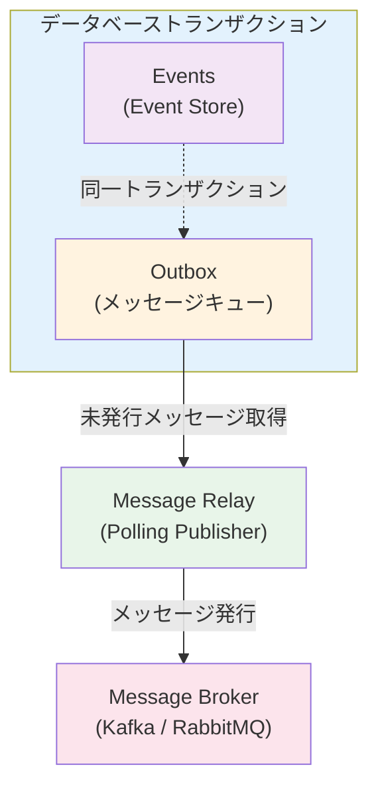

# 04. Transactional Outbox Pattern

## 概要

Transactional Outboxパターンは、データベース更新とメッセージ発行を原子的に実行するためのパターンです。2PC（Two-Phase Commit）を使わずに、データの一貫性を保証します。

## 問題

### Dual Write Problem（二重書き込み問題）
```ruby
# 問題のあるコード
def create_order(params)
  order = Order.create(params)          # データベースに書き込み
  message_broker.publish(order_event)   # メッセージブローカーに発行
  # どちらかが失敗したら？データの不整合が発生！
end
```

### 発生しうる問題
1. データベース更新は成功、メッセージ発行は失敗
2. メッセージ発行は成功、データベース更新は失敗
3. メッセージの重複発行

## 解決策: Outbox Pattern



## アーキテクチャ

### 1. Outboxテーブル
```sql
CREATE TABLE outbox (
    id BIGSERIAL PRIMARY KEY,
    aggregate_id VARCHAR(255) NOT NULL,
    event_type VARCHAR(255) NOT NULL,
    payload JSONB NOT NULL,
    created_at TIMESTAMP DEFAULT NOW(),
    published_at TIMESTAMP,
    published BOOLEAN DEFAULT FALSE
);
```

### 2. Message Relay（メッセージリレー）
Outboxテーブルからメッセージを読み取り、メッセージブローカーに発行する

#### 実装方法
1. **Polling Publisher**: 定期的にOutboxをポーリング
2. **Transaction Log Tailing**: WAL（Write-Ahead Log）を監視（CDC）

## 実装パターン

### Write時の処理
```ruby
# トランザクション内で両方を実行
ActiveRecord::Base.transaction do
  # 1. イベントを保存
  event_store.append(event)

  # 2. Outboxに記録
  outbox.add(event)
end
```

### Message Relayの処理
```ruby
loop do
  # 1. 未発行のメッセージを取得
  messages = outbox.fetch_unpublished(limit: 100)

  messages.each do |message|
    # 2. メッセージブローカーに発行
    message_broker.publish(message)

    # 3. 発行済みとしてマーク
    outbox.mark_as_published(message.id)
  end

  sleep 1
end
```

## ファイル構成

- `migration.sql`: Outboxテーブル定義
- `outbox.rb`: Outboxモデル
- `outbox_publisher.rb`: Message Relay（Polling方式）
- `message_broker.rb`: メッセージブローカーのインターフェース
- `example.rb`: 使用例
- `outbox_spec.rb`: テストコード

## メリット

1. **原子性**: データベース更新とメッセージ発行が確実に連携
2. **信頼性**: メッセージの確実な配信
3. **シンプル**: 2PCや分散トランザクション不要

## 注意点

### 1. At-Least-Once配信
- メッセージが重複する可能性あり
- **消費者側で冪等性を実装する必要がある**

### 2. メッセージの順序保証
- 同じaggregate_id内では順序を保証
- 異なるaggregateでは順序保証なし

### 3. Outboxのクリーンアップ
- 発行済みメッセージを定期的に削除
- または発行済みフラグでフィルタリング

## 学べること

- Dual Write問題の理解と解決
- トランザクション境界の重要性
- At-Least-Once配信の実装
- Polling Publisherの実装
- 冪等性の重要性
