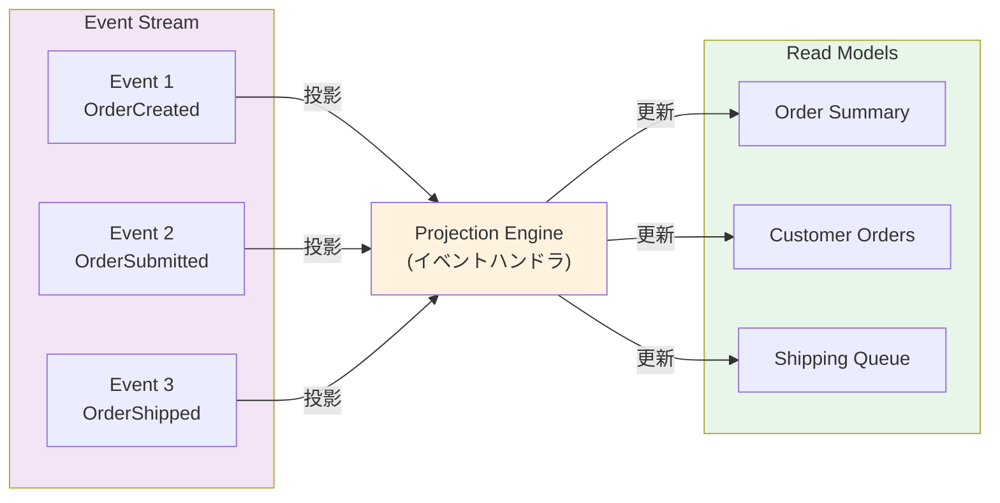
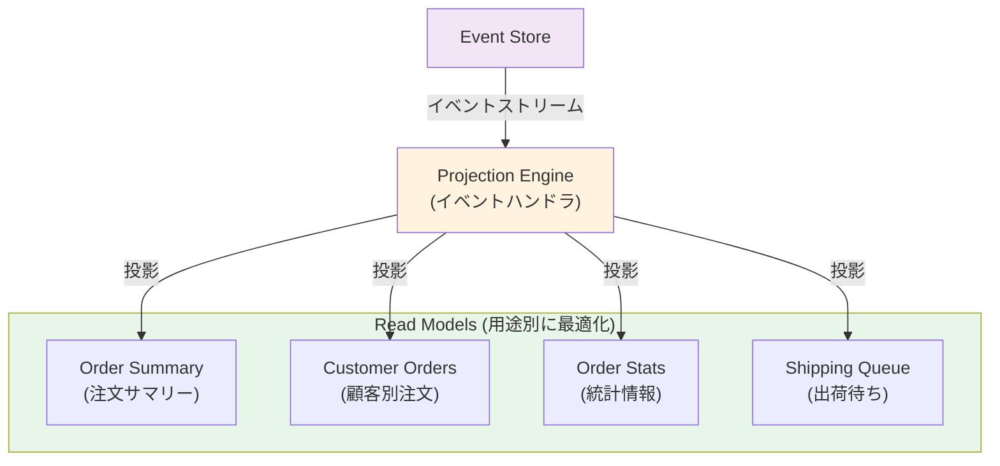

# 05. Projection Pattern

## 概要

Projectionは、Event Streamから Read Model を生成・更新するパターンです。イベントを「投影」して、クエリに最適化されたビューを作成します。

## 主要概念

### Projection（投影）



イベントの履歴から、現在の状態や特定のビューを生成する処理

### Read Model
- クエリに最適化されたデータ構造
- 非正規化（denormalized）
- 複数のRead Modelを持てる（用途別）

## Projectionの種類

### 1. 同期Projection（Inline Projection）
```ruby
# イベント保存と同じトランザクション内で更新
ActiveRecord::Base.transaction do
  event_store.append(event)
  projection.project(event)  # 同期的に更新
end
```

**メリット**: 強い整合性
**デメリット**: パフォーマンスへの影響

### 2. 非同期Projection（Async Projection）
```ruby
# バックグラウンドワーカーで更新
EventSubscriber.subscribe do |event|
  projection.project(event)
end
```

**メリット**: 高パフォーマンス、スケーラブル
**デメリット**: 結果整合性（Eventual Consistency）

## アーキテクチャ



## 実装パターン

### Projectionクラス
```ruby
class OrderSummaryProjection
  def project(event)
    case event.event_type
    when 'OrderCreated'
      on_order_created(event)
    when 'OrderSubmitted'
      on_order_submitted(event)
    when 'OrderShipped'
      on_order_shipped(event)
    end
  end

  private

  def on_order_created(event)
    # Read Modelを作成
  end

  def on_order_submitted(event)
    # Read Modelを更新
  end
end
```

## Projectionの再構築

既存のRead Modelを削除し、すべてのイベントを再生することで、Read Modelを再構築できます。

```ruby
def rebuild
  # Read Modelをクリア
  OrderReadModel.delete_all

  # すべてのイベントを再生
  event_store.read_all_events.each do |event|
    project(event)
  end
end
```

**用途**:
- スキーマ変更
- バグ修正
- 新しいRead Modelの追加

## ファイル構成

- `projection.rb`: Projection基底クラス
- `order_summary_projection.rb`: 注文サマリーのProjection
- `projection_manager.rb`: Projectionの管理・実行
- `checkpoint.rb`: Projectionの進捗管理
- `example.rb`: 使用例
- `projection_spec.rb`: テストコード

## Checkpointパターン

Projectionの処理位置を記録し、中断から再開できるようにする

```sql
CREATE TABLE projection_checkpoints (
    projection_name VARCHAR(255) PRIMARY KEY,
    last_event_id BIGINT NOT NULL,
    updated_at TIMESTAMP
);
```

## メリット

1. **柔軟なクエリ**: 用途別に最適化されたビュー
2. **パフォーマンス**: 非正規化によるクエリの高速化
3. **スケーラビリティ**: 読み取りを独立してスケール
4. **再構築可能**: イベントから何度でも再生成

## 注意点

1. **結果整合性**: 非同期Projectionでは遅延あり
2. **重複処理**: 冪等性が必要
3. **順序保証**: イベントの順序を保つ必要がある

## 学べること

- Event StreamからRead Modelを生成
- 同期・非同期Projectionの実装
- Checkpointによる進捗管理
- Projectionの再構築
- 複数のRead Modelの管理
